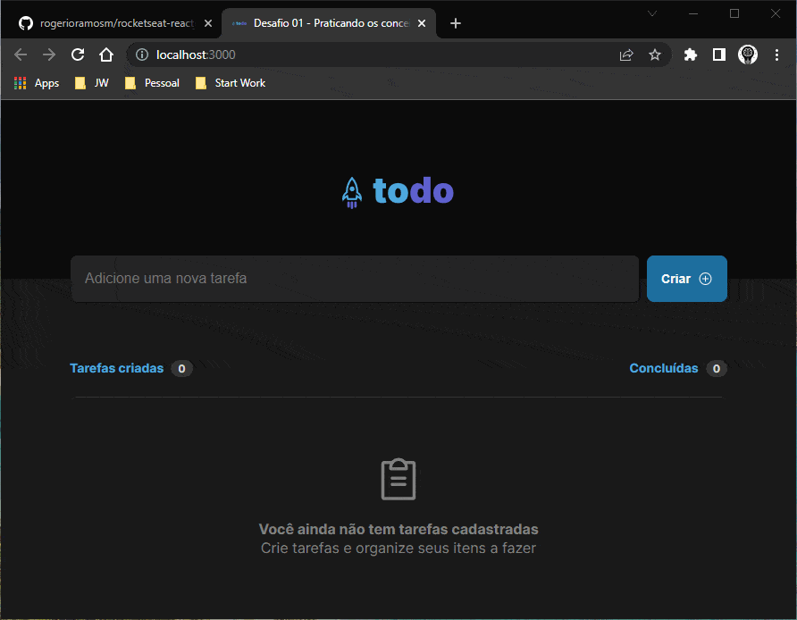

# Desafio 01 - Praticando os conceitos do ReactJS

Projeto para análise do primeiro módulo do curso `ReactJS - Rockeseat`

---

## Demonstração

Entrega do primeiro `App` em `ReactJS` do desafio do primeiro módulo



---

## Inicializar projeto

Depois de baixar, execute os comandos abaixo para rodar `App` :

```bash
  #Instalar todas as dependências
  npm i

  #Inicializar servidor com vite
  npm run dev
```
